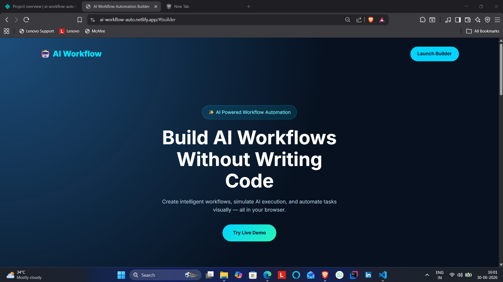
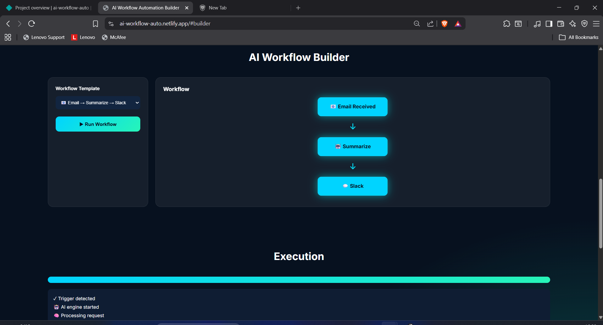
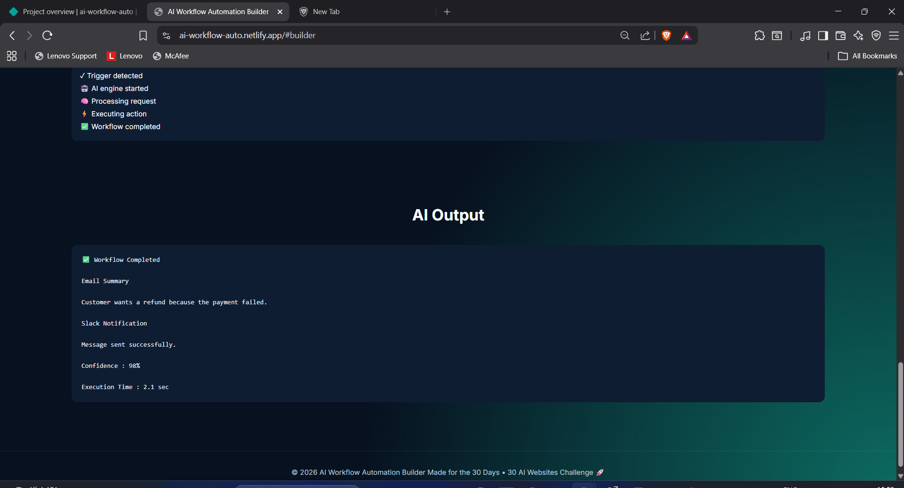

# AI Workflow Automation Builder

## 🚀 Day 22 of my 30 Days 30 AI Websites Challenge

AI Workflow Automation Builder is an AI-inspired web application that enables users to visually create, simulate, and understand intelligent automation workflows without writing code.

The application demonstrates how modern AI workflow platforms operate by allowing users to select predefined workflow templates, execute simulated AI workflows, monitor execution progress, view real-time execution logs, and receive AI-generated outputs.

Rather than simply displaying a static interface, the platform provides an interactive workflow simulation that illustrates how AI-powered automation systems process triggers, execute AI tasks, and perform automated actions.

This project demonstrates frontend workflow orchestration concepts commonly found in AI automation platforms while running entirely in the browser using HTML, CSS, and JavaScript.

---

## 🌐 Live Demo

https://ai-workflow-auto.netlify.app/

---

## 📸 Screenshots

### Screenshot 1

### Screenshot 2

### Screenshot 3

---

## ✨ Features

- Interactive AI Workflow Builder
- Workflow Template Selection
- AI Workflow Simulation
- Visual Workflow Execution
- Animated Progress Tracking
- Real-Time Execution Logs
- AI Output Simulation
- Typing Animation Effect
- Responsive SaaS UI
- Glassmorphism Design
- No Backend Required
- Fully Responsive Design

---

## 📋 How It Works

1. Select an AI workflow template.
2. Click **Run Workflow**.
3. Watch the workflow execute step by step.
4. Monitor the execution progress.
5. View real-time execution logs.
6. Receive the simulated AI-generated output.

---

## 🛠 Technologies Used

- HTML
- CSS
- JavaScript
- Built with the help of AI-assisted development tools

---

## 🎯 Challenge Progress

✅ **Day 22 Completed — AI Workflow Automation Builder**

Part of my **30 Days • 30 AI Websites Challenge**, where I build and publish one AI-powered web project every day to improve my frontend development, product-building, and problem-solving skills.

---

## 👨‍💻 Author

**Bettam Anand**

B.Tech CSE (Data Science)

JNTUH University College of Engineering Palair

---

⭐ If you found this project interesting, consider giving it a **Star** on GitHub!
